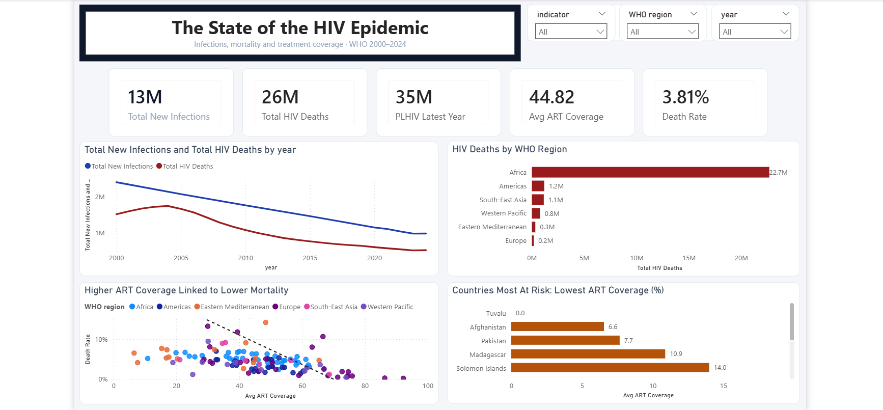
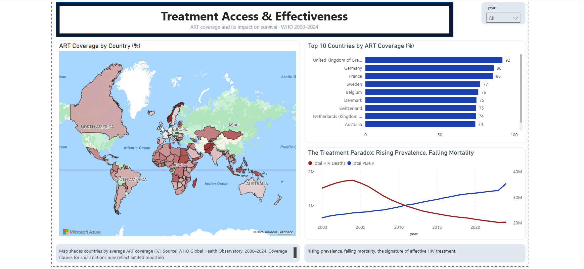

# Global HIV Trends & Treatment Effectiveness Analysis

**Author:** Peret Brenda Dadah

**Tool:** Power BI · Power Query · DAX 

**Data source:** WHO Global Health Observatory (GHO)

**Scope:** 9,763 records · 150 countries · 2000–2024

## Project Highlights

✔ Interactive Power BI Dashboard
✔ Star Schema Data Model
✔ 9 Custom DAX Measures

✔ Power Query Data Transformation
✔ Health Data Quality Assessment
✔ WHO Global Health Observatory Dataset

---

## The Question

Which countries and regions have made the most progress closing the HIV treatment gap and where does the underlying data need to be interrogated before it can be trusted?

## Business Problem

HIV programme managers and policymakers need reliable insights to monitor treatment access, identify regional disparities, and evaluate programme performance. This dashboard was developed to support evidence-based decision making using WHO Global Health Observatory (GHO) data while demonstrating the importance of data quality, validation, and transparent reporting in health analytics.

## Key Findings

- ART coverage was measured using AVERAGE rather than SUM, since coverage is a rate not an additive quantity. Summing it would have produced values with no real-world meaning.
- PLHIV (People Living with HIV) is a stock metric, not a flow. Several regional comparisons in early drafts were distorted until this distinction was corrected.
- A censoring floor was identified : roughly 16% of records were capped at exactly 100, a reporting artefact rather than a genuine data point. This is disclosed transparently in the dashboard rather than smoothed over.
- The original "deaths" metric produced misleading regional rankings due to population-size distortion; it was replaced with an ART coverage ranking, which better reflects programme performance.

## Dashboard

The report contains two interactive pages:

### Page 1 – The State of the HIV Epidemic
Global and regional trends, 2000 – 2024

()

### Page 2 – Treatment Access & Effectiveness
ART coverage, country rankings, and programme performance

## Technical Build

- **Data model:** Star schema; one fact table (`Fact_HIV`) and three dimension tables
- **DAX:** 9 custom measures, including coverage rate calculations, ranking logic, and year-over-year comparisons
- **Power Query:** Used for data transformation, cleaning, and preparation including correcting mislabelled fields (a "continent" field was found to actually represent WHO Region), duplicate handling, and censoring-floor disclosure

## Skills Demonstrated

- Power BI
- DAX
- Data Modelling
- Star Schema Design
- Power Query
- Data Cleaning
- Data Validation
- Health Data Analytics
- Data Storytelling

## Files in This Repository

| File | Description |
|---|---|
| `HIV_Trends_Dashboard.pbix` | Full Power BI file (data model, DAX, visuals) |
| `HIV_Capstone_Report.pdf` | Capstone presentation deck summarizing methodology and key findings |
| `/screenshots` | Dashboard page exports (PNG) |

## About Me

I'm a physician and public health specialist with over 14 years of experience strengthening health systems through programme management, monitoring & evaluation, and data-driven decision-making.

Today, I am building solutions at the intersection of **Health Data, Digital Health, AI Governance, and Project Leadership**.

This project reflects how I approach analytics not just building dashboards, but validating the data behind them so decision-makers can trust the insights they use.

## Let's Connect

**LinkedIn:** [https://www.linkedin.com/in/pbdadah](https://www.linkedin.com/in/pbdadah)

**Open to opportunities in:**
- Health Data Analytics
- Digital Health
- Business Intelligence
- Health Informatics
- AI-enabled Health Systems
